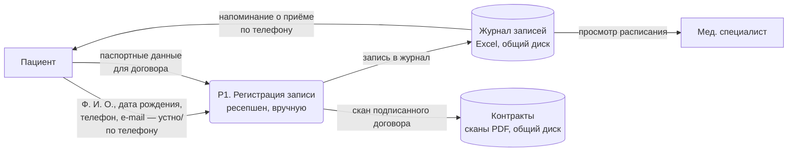
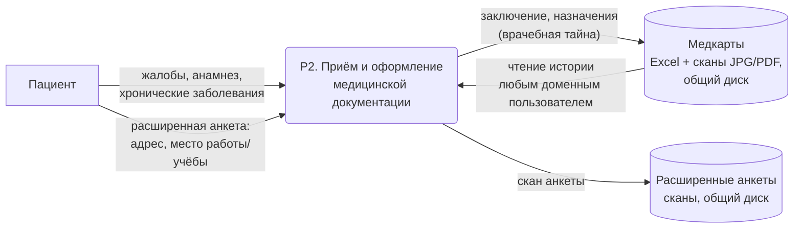
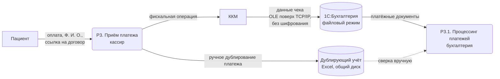
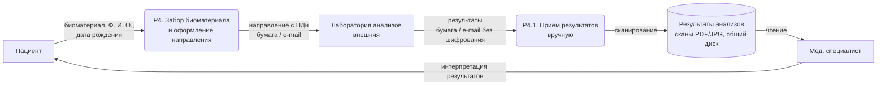
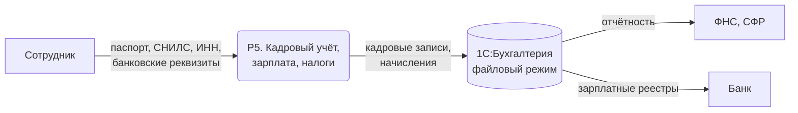
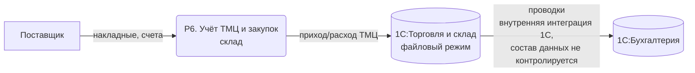
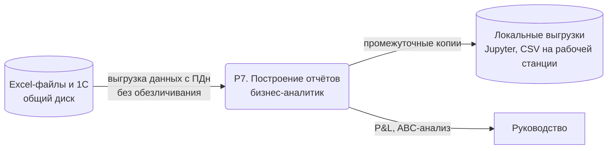

# Диаграммы потоков данных As-Is

Одна диаграмма на процесс. Нотация: прямоугольник — внешняя сущность, скруглённый блок — процесс, цилиндр — хранилище.

Общая характеристика всех потоков As-Is: передача без шифрования, хранилища без разграничения доступа (кроме доменной аутентификации), операции без аудита.

## P1. Запись пациента на приём

Операции: ручной ввод, чтение всеми сотрудниками, редактирование без версионирования.

## P2. Приём пациента и ведение медицинской карты

Операции: сканирование, ручное заполнение Excel, чтение без ограничения по ролям.

## P3. Оплата услуг

Операции: двойной ввод (Excel + 1С), передача по OLE без защиты канала.

## P4. Учёт анализов

Операции: передача ПДн внешнему контрагенту по открытым каналам, ручное сканирование.

## P5. Бухгалтерия, кадры, зарплата

Операции: ввод ПДн сотрудников, формирование отчётности; файлы БД 1С доступны на уровне файловой системы.

## P6. Учёт ТМЦ и закупки

Операции: ручной ввод первички, автоматический обмен между базами 1С без контроля состава данных.

## P7. Отчётность и аналитика

Операции: копирование «сырых» ПДн на локальную машину, обработка в Jupyter/Python вне контролируемого контура.
