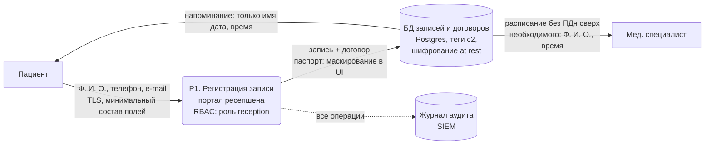
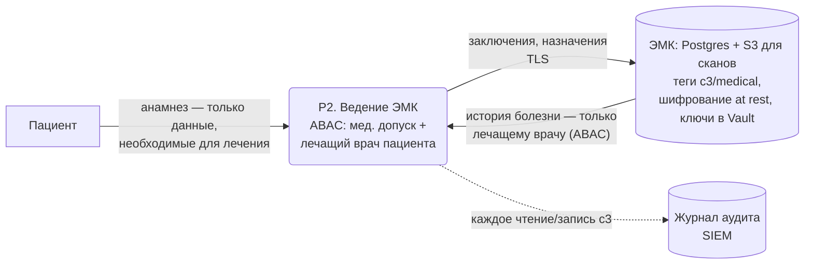
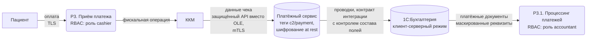
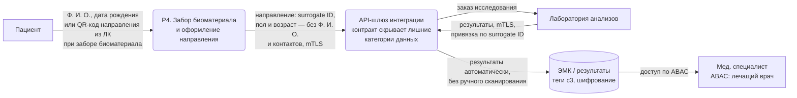
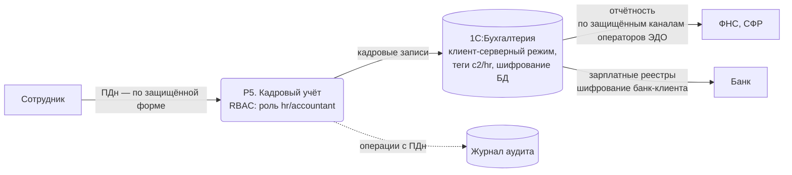
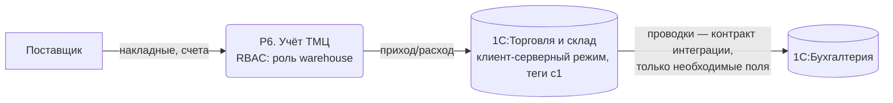
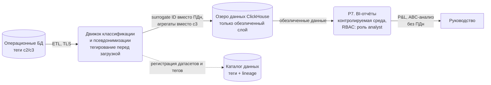

# Диаграммы потоков данных To-Be (с мерами защиты)

Доработанные диаграммы: на каждом этапе потока указаны применяемые меры. Сквозные меры для всех процессов:

- аутентификация через IdP (Keycloak + AD), MFA;
- доступ по тегам данных (RBAC/ABAC), least privilege;
- TLS для всех соединений, шифрование хранилищ at rest;
- аудит всех обращений к данным `c2/c3` → SIEM (Elastic) → алертинг при нетипичных действиях;
- DLP на периметре (почта, USB, печать).

## P1. Запись пациента на приём

Меры: Data Minimization на форме ввода; паспортные данные видны только роли, оформляющей договор; журнал в Excel упразднён.

## P2. Приём пациента и ведение медицинской карты

Меры: общий диск исключён; доступ к медкарте — только у медперсонала с атрибутом «лечащий врач»; расширенная анкета не собирается без цели обработки; retention-тег управляет сроком хранения.

## P3. Оплата услуг

Меры: двойной учёт в Excel упразднён — единственный источник истины; канал ККМ переведён с OLE на защищённый API; 1С — в клиент-серверный режим.

## P4. Учёт анализов

Меры: псевдонимизация в обмене с лабораторией — контрагент не получает полный набор ПДн; API-контракт исключает доступ к чужим данным (проверка принадлежности по subject ID); ручное сканирование упразднено.

## P5. Бухгалтерия, кадры, зарплата

Меры: файловый режим 1С заменён на клиент-серверный с разграничением доступа на уровне СУБД; доступ к зарплатным данным — только у роли «бухгалтерия».

## P6. Учёт ТМЦ и закупки

Меры: обмен между базами 1С — по контракту с контролем состава полей; данные ТМЦ (c1) не смешиваются с ПДн.

## P7. Отчётность и аналитика

Меры: аналитика только на псевдонимизированных данных; локальные выгрузки и Jupyter на рабочей станции упразднены — работа в контролируемой среде; каталог данных обеспечивает lineage от источника до отчёта.
