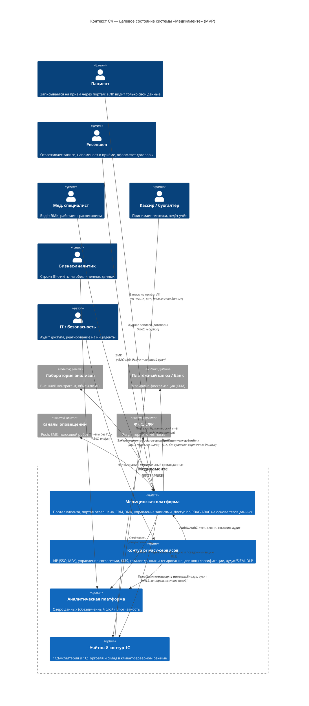
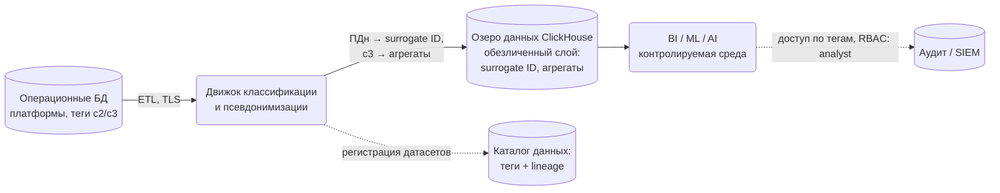

# Задание 2. Целевая архитектура: диаграмма контекста C4 (Privacy by Design)

## Вывод

Целевая архитектура строится вокруг единой медицинской платформы и выделенного **контура privacy-сервисов** — набора блоков, которые обеспечивают соблюдение Privacy by Design для всех компонентов системы одновременно, а не в каждом по отдельности. Аналитическая работа выносится в отдельный слой, который получает данные только через обязательную классификацию и псевдонимизацию — «сырые» ПДн в аналитику не попадают by default.

## Диаграмма контекста C4 (To-Be, MVP)

## Новые блоки, обеспечивающие Privacy by Design

Блоки контура privacy-сервисов являются общими для всех систем: любой новый сервис или интеграция подключается к ним обязательно и получает защиту «по умолчанию» — перевалидация при добавлении интеграций не требуется.

| Блок | Назначение | Принцип Privacy by Design |
|---|---|---|
| IdP (Keycloak + существующий AD) | SSO, MFA, единая выдача ролей и атрибутов для RBAC/ABAC | End-to-end security; proactive, not reactive |
| API-шлюз | Единая точка входа; контракты скрывают конфиденциальные категории; проверка принадлежности данных субъекту (пациент видит только свои данные) | Privacy as the default setting |
| Сервис управления согласиями | Реестр согласий и целей обработки; исполнение запросов на отзыв и удаление данных (152-ФЗ ст. 21) | Respect for user privacy |
| Каталог данных + тегирование | Реестр датасетов, теги `confidentiality/category/retention/consent-scope`, data lineage | Visibility and transparency |
| Движок классификации | Автоматическое тегирование данных перед загрузкой в хранилища (детально — Task 6) | Privacy embedded into design |
| KMS / Vault | Централизованное управление ключами шифрования at rest / in transit | End-to-end security |
| Аудит + SIEM (Elastic, Victoria Metrics) | Журналирование всех обращений к данным c2/c3, выявление нетипичных действий, алертинг | Visibility and transparency |
| DLP | Контроль периметра: почта, USB, печать | Proactive, not reactive |
| CI-контроль релизов | Автоматическая проверка релизов на корректную работу с тегированными данными; результат — в мониторинг | Privacy embedded into design |

Enforcement-модель: политики доступа ссылаются на **теги**, а не на конкретные таблицы и сервисы. Правило «роль без медицинского допуска не читает `c3`» автоматически распространяется на любые новые данные и интеграции — функциональность не ограничивается, защита не требует компромисса (full functionality, positive-sum).

## Аналитический слой с учётом Privacy by Design

Принципы слоя:
- **Единственный вход в аналитику — через движок классификации и псевдонимизации.** Прямых подключений BI к операционным БД нет.
- В озере данных нет прямых идентификаторов: Ф. И. О., телефоны, паспортные данные заменены на surrogate ID; медицинские данные (c3) доступны аналитике только в агрегированном или псевдонимизированном виде.
- Обезличенные данные пригодны для BI, обучения ML/AI и LLM без согласия субъектов (152-ФЗ), что снимает регуляторный риск с направления «данные как продукт».
- Каталог данных даёт lineage от источника до отчёта; доступ аналитиков — в контролируемой среде вместо локальных Jupyter-выгрузок.

## Область MVP (промежуточное состояние, 2 месяца)

1. Портал клиента: самостоятельная запись на приём (домены: identity c2, scheduling c2).
2. Портал ресепшена: просмотр записей, напоминания пациенту и специалисту за день до приёма.
3. Контур privacy-сервисов в минимальном составе: IdP, RBAC/ABAC по доменам данных, аудит доступа, шифрование хранилищ.
4. Категории данных разнесены по доменам: `identity` (c2), `scheduling` (c2), `medical` (c3), `payment` (c2), `hr` (c2), `inventory` (c1); роли: patient, reception, doctor, cashier, accountant, analyst, security.

За пределами MVP (финальное состояние, год): мобильное приложение, голосовой робот, автоматическая проверка релизов на тегированные данные, поведенческий анализ действий пользователей.

## Trade-offs

- **Единый контур privacy-сервисов** упрощает соответствие требованиям, но становится критической зависимостью: отказ IdP останавливает работу. Компенсация — резервирование контура (Kubernetes, несколько реплик).
- **Псевдонимизация в аналитике** ограничивает сценарии, требующие идентификации пациента (например, персональные рассылки из BI); такие сценарии выполняются в операционном контуре по согласию.
- **Сохранение 1С** (вместо замены) снижает стоимость и риски миграции, но требует поддержки контрактов интеграции с платформой.
