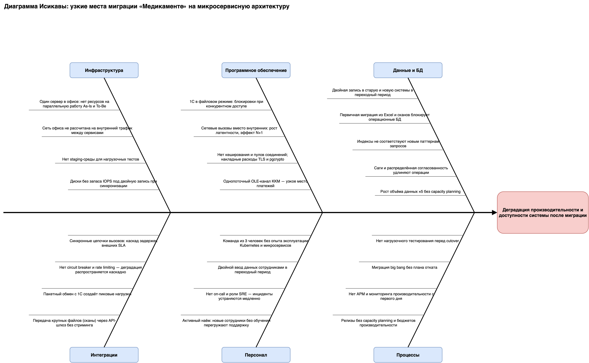

# Задание 4. Оценка узких мест при миграции

## Вывод

Главные риски снижения производительности при миграции «Медикаменте» на микросервисную архитектуру сосредоточены не в новой системе, а в точках её сосуществования со старой: единственный сервер, двойная запись данных, файловый режим 1С и синхронные интеграции. Без устранения пяти приоритетных проблем (P1) до cutover новая система будет работать хуже текущей.

## 1. Анализ: что затрагивает миграция

| Компонент | Изменение при миграции | Чувствительность к производительности |
|---|---|---|
| Хранилища данных | Excel/сканы с общего диска → Postgres, MinIO, ClickHouse; первичная массовая загрузка | Высокая: объём ×5, двойная запись в переходный период |
| Бизнес-логика | Монолитные приложения и ручные процессы → микросервисы (порталы, CRM, платёжный сервис) | Высокая: внутренние вызовы становятся сетевыми |
| Коммуникационные каналы | OLE/файловый обмен → REST/mTLS через API-шлюз, очереди | Средняя: новые накладные расходы TLS, сериализации |
| Серверное оборудование | Один физический сервер в офисе → кластер Kubernetes | Критическая: ресурсов на параллельную работу двух систем нет |
| Учётный контур 1С | Файловый режим → клиент-серверный; обмен с платформой по контракту | Высокая: файловый режим блокируется при конкурентном доступе |
| Персонал и процессы | Ручной ввод → работа в порталах; релизный цикл, эксплуатация K8s | Средняя: опыта эксплуатации распределённых систем нет |

## 2. Диаграмма Исикавы

Файл: **[task4-ishikawa.drawio](task4-ishikawa.drawio)**

Следствие (голова): **деградация производительности и доступности системы после миграции**. Категории причин: Инфраструктура, Программное обеспечение, Данные и БД, Интеграции, Персонал, Процессы — 25 причин суммарно.

## 3. Выявленные проблемы и решения

### Инфраструктура
| Проблема | Решение |
|---|---|
| Один сервер: нет ресурсов на параллельную работу As-Is и To-Be | Развернуть целевой контур на отдельной площадке (арендованный ЦОД/кластер), офисный сервер оставить только под As-Is до завершения миграции |
| Сеть офиса не рассчитана на внутренний трафик между сервисами: в микросервисной архитектуре один пользовательский запрос порождает 5–10 сетевых вызовов сервис ↔ сервис | Вынести весь межсервисный обмен внутрь одной площадки (кластер в ЦОД); офисной сети оставить только клиентские подключения сотрудников к порталам |
| Нет staging | Staging-среда с копией обезличенных данных, обязательные нагрузочные прогоны |
| Диски без запаса IOPS | SSD/NVMe под БД, расчёт IOPS с учётом двойной записи |

### Программное обеспечение
| Проблема | Решение |
|---|---|
| 1С в файловом режиме: блокировки | Перевод в клиент-серверный режим до начала интеграций |
| Рост латентности: сетевые вызовы, N+1 | Правило: не более одного синхронного hop'а на пользовательский запрос; агрегирующие API; профилирование в staging |
| Нет кеширования и пулов; накладные расходы TLS/pgcrypto | Connection pooling (PgBouncer), кеш справочников, keep-alive/session resumption, pgcrypto только для точечных полей |
| Однопоточный OLE-канал ККМ | Замена на API платёжного сервиса (mTLS) с очередью фискальных операций |

### Данные и БД
| Проблема | Решение |
|---|---|
| Двойная запись в переходный период | CDC-репликация (одна система — источник истины) вместо двойной записи из приложений |
| Первичная миграция блокирует БД | Загрузка партиями в окна минимальной нагрузки, отдельная ETL-очередь, идемпотентные джобы |
| Индексы под старые паттерны | Анализ планов запросов на staging, пересмотр индексов до cutover |
| Саги удлиняют операции | Синхронная согласованность только внутри домена; между доменами — события; UX не ждёт завершения саги |
| Рост ×5 без capacity planning | Модель нагрузки ×5, партиционирование, ретеншн-политики по тегам |

### Интеграции
| Проблема | Решение |
|---|---|
| Каскад задержек внешних SLA | Асинхронные интеграции с лабораторией и 1С через очередь; тайм-ауты и ретраи с backoff |
| Нет circuit breaker / rate limiting | Включить на API-шлюзе с первого дня |
| Пакетный обмен с 1С — пики | Перейти на событийный обмен малыми порциями (CDC) |
| Крупные файлы через шлюз | Прямая загрузка в MinIO по presigned-ссылкам, минуя шлюз |

### Персонал
| Проблема | Решение |
|---|---|
| 3 человека без опыта K8s | Найм DevOps/SRE (ресурсы выделены руководством), обучение, managed-сервисы где возможно |
| Двойной ввод данных | Сократить переходный период; ввод только в новую систему, репликация в старую автоматически |
| Нет on-call | Дежурства с алертами из SIEM/Victoria Metrics на период cutover — обязательны |
| Наплыв новых сотрудников | Обучение до перевода на новую систему, роль-ограниченные интерфейсы |

### Процессы
| Проблема | Решение |
|---|---|
| Нет нагрузочного тестирования | Обязательные load-тесты (профиль ×5) как критерий готовности к cutover |
| Big bang без отката | Поэтапная миграция (strangler fig) по доменам; план отката на каждый этап |
| Нет APM с первого дня | Метрики латентности/ошибок/насыщения (Victoria Metrics), трассировка, SLO до первого пользователя |
| Релизы без capacity planning | Бюджеты производительности в Definition of Done, регрессионные load-тесты в CI |

## 4. Приоритизация мер

| Приоритет | Меры | Критерий |
|---|---|---|
| **P1 — блокируют cutover** | Отдельная площадка для целевого контура; перевод 1С в клиент-серверный режим; CDC вместо двойной записи; нагрузочное тестирование ×5 на staging; APM/мониторинг и план отката | Без них деградация в день перехода практически гарантирована |
| **P2 — первый месяц эксплуатации** | Замена OLE-канала ККМ; circuit breaker и rate limiting на шлюзе; пулы соединений и кеширование; асинхронные интеграции через очередь; пересмотр индексов; найм и обучение SRE, on-call | Устраняют накопительные и каскадные деградации под растущей нагрузкой |
| **P3 — до масштабирования на филиалы** | Presigned-загрузка файлов; событийный обмен с 1С (CDC); партиционирование и ретеншн; бюджеты производительности и load-тесты в CI | Готовят систему к росту ×5 и мультифилиальности |

## Метод

Диаграмма Исикавы применена к следствию «деградация производительности и доступности»; причины собраны по шести категориям на основе анализа As-Is (Task 1), целевой архитектуры (Task 2) и ограничений компании (один сервер, команда из трёх человек, файловый режим 1С, рост ×5). Приоритеты назначены по критерию «влияние на день cutover → влияние под нагрузкой → влияние при масштабировании».
