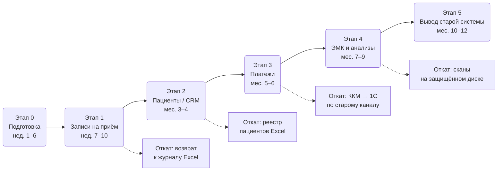

# Задание 5. Стратегия миграции и cutover-план

## Вывод

Выбрана стратегия **Parallel run** с разбиением по доменам данных: старая и новая системы работают параллельно ограниченное время, нагрузка переводится домен за доменом (записи → CRM → платежи → ЭМК), каждый перевод завершается собственным малым cutover'ом со сверкой данных и планом отката. Big bang исключён: цена ошибки — остановка приёма пациентов и фискального учёта.

## 1. Анализ ситуации

Особенности, определяющие выбор стратегии:

1. **«Старая система» — не кодовая база, а набор ручных практик**: Excel, сканы на общем диске, файловая 1С. Кода, в который можно встраивать абстракции, не существует.
2. **Цена ошибки максимальна в двух доменах**: платежи (54-ФЗ, фискальные данные) и ЭМК (врачебная тайна). Потеря или расхождение данных недопустимы.
3. **Персонал не работал с автоматизированными системами** — нужен период освоения с возможностью вернуться к привычному процессу.
4. **Команда мала** (3 человека + план найма) — одновременный перевод всех процессов не обеспечен ресурсами поддержки.
5. Бизнес работает непрерывно: клиника не может остановить приём на время миграции.

## 2. Сравнение стратегий и обоснование выбора

| Стратегия | Преимущества для нашего случая | Ограничения / почему не выбрана основной |
|---|---|---|
| **High-level design** (DDD, модульные границы) | Домены уже выделены (Task 2): identity, scheduling, medical, payment. Используем как *принцип проектирования* целевой системы | Это подход к проектированию, а не сценарий переключения: не отвечает на вопросы «как переводить нагрузку» и «как откатываться». Сам по себе плана миграции не даёт |
| **Branch by abstraction** (послойная замена за абстракцией) | Хорош для живой кодовой базы без остановки разработки | Неприменим: у «Медикаменте» нет монолита с кодом, в который можно ввести слой абстракции. Excel и ручные журналы нельзя «спрятать за интерфейс». Для 1С используем элемент этого подхода — контракт интеграции как абстракцию над учётным контуром |
| **Parallel run** | Прямая сверка старого и нового учёта до переключения — критично для платежей и медданных; мгновенный откат (старый процесс продолжает работать); постепенное освоение персоналом; перевод нагрузки по доменам малыми порциями риска | Двойное ведение данных нагружает сотрудников; требуется синхронизация и регулярная сверка; риск «вечного параллельного периода» — снимается жёсткими сроками окна на каждый домен |

**Итог**: Parallel run как стратегия переключения + доменные границы из High-level design как единица миграции + контракт-абстракция над 1С как локальный приём Branch by abstraction.

## 3. Общая схема миграции

Каждый этап повторяет один и тот же цикл: **подготовка → параллельная работа со сверкой → go/no-go → переключение → усиленный мониторинг → закрытие старого ввода**.

## 4. Cutover-план

| Этап | Описание действия | Ключевые задачи | Ответственные | Время / сроки | Риски и меры по снижению |
|---|---|---|---|---|---|
| **0. Подготовка** | Создание целевой инфраструктуры и базовых сервисов без влияния на работу компании | Кластер K8s на отдельной площадке; privacy-контур (IdP, Vault, аудит); перевод 1С в клиент-серверный режим; staging + нагрузочные тесты ×5; обучение сотрудников; найм DevOps/SRE | Техдиректор (архитектура), сисадмин + DevOps (инфраструктура), подрядчик 1С | Недели 1–6 | Недооценка сроков — буфер 30%; 1С-переход в выходные с бэкапом и репетицией восстановления |
| **1. Записи на приём (MVP)** | Параллельная работа портала и журнала Excel; ресепшен ведёт оба, сверка ежедневно | Импорт справочников; двойной ввод записей (2 нед.); ежедневная автосверка отчётом; go/no-go; перевод записи только в портал | Бизнес-аналитик (сверка), старший ресепшена (процесс), техдиректор (go/no-go) | Недели 7–10; параллельное окно — максимум 2 нед. | Расхождения журнала и портала — автосверка каждый вечер, расхождение >2% продлевает параллель на неделю; перегрузка ресепшена — двойной ввод только по записям, без истории |
| **2. Пациенты / CRM** | Первичная миграция реестра пациентов и договоров из Excel/сканов в CRM | Очистка и дедупликация Excel; загрузка партиями в ночные окна; верификация контрольных сумм (кол-во, обязательные поля); параллельное ведение 2 нед.; классификация и тегирование при загрузке | Бизнес-аналитик (качество данных), разработчики (ETL), офицер безопасности (теги) | Месяцы 3–4 | Грязные данные — правила очистки и ручная разметка спорных записей до загрузки; дубли пациентов — детерминированный матчинг Ф. И. О. + дата рождения + телефон, спорные случаи в ручную очередь |
| **3. Платежи** | Самый рискованный этап: перевод ККМ на новый платёжный сервис при непрерывности фискального учёта | Новый канал ККМ → платёжный сервис → 1С (mTLS) параллельно со старым OLE; 2 недели двойного прогона на одной кассе (пилот); сверка касса/1С/сервис ежедневно до копейки; поэтапно остальные кассы; отключение OLE | Техдиректор (go/no-go), бухгалтерия (сверка сумм), DevOps (канал), подрядчик 1С | Месяцы 5–6; переключение каждой кассы — в нерабочие часы | Расхождение фискальных данных — сверка до копейки, любое расхождение = стоп и разбор; отказ нового канала — старый OLE-канал сохраняется в горячем резерве до конца этапа; точка невозврата — только после 2 недель нулевых расхождений |
| **4. ЭМК и анализы** | Перенос медкарт и результатов анализов в ЭМК; включение интеграции с лабораторией | Сканирование/загрузка архива в MinIO (SSE-KMS) с тегированием c3; врачи ведут новые приёмы только в ЭМК, архив читается из ЭМК; ABAC «лечащий врач»; API лаборатории с surrogate ID; общий диск переводится в read-only | Техдиректор, главврач (приёмка процесса), офицер безопасности (доступы, аудит), разработчики | Месяцы 7–9 | Недоступность истории пациента на приёме — архив остаётся читаемым в read-only до полной верификации; сопротивление врачей — обучение, поддержка на месте в первые 2 недели, канал обратной связи |
| **5. Вывод старой системы** | Закрытие параллельного периода и ликвидация теневых копий данных | Отключение записи на общий диск; криптографическое уничтожение/архивирование Excel-файлов поретеншн-политике; финальный аудит: конфиденциальные данные существуют только в целевых хранилищах; отчёт руководству | Офицер безопасности (аудит остатков), сисадмин (диск), техдиректор (отчёт) | Месяцы 10–12 | Теневые копии у сотрудников — DLP-контроль + сканер классификации по рабочим станциям; преждевременное удаление — архив с шифрованием хранится до истечения сроков по 323-ФЗ |

## 5. День переключения: почасовой сценарий (шаблон, пример — этап 3 «Платежи», одна касса)

| Время | Действие | Ответственный | Критерий продолжения |
|---|---|---|---|
| Пт 19:00 | Закрытие смены ККМ, финальный Z-отчёт, бэкап 1С | Кассир, подрядчик 1С | Отчёт сформирован, бэкап проверен |
| Пт 20:00 | Переключение кассы на новый канал (mTLS), тестовый чек + возврат | DevOps | Чек прошёл в 1С и ОФД |
| Пт 21:00 | Сверка тестовых операций касса/сервис/1С | Бухгалтер | Расхождение = 0 |
| Пт 21:30 | **Go / No-go** | Техдиректор | Все критерии зелёные; иначе возврат на OLE (15 минут) |
| Сб–Вс | Мониторинг: латентность канала, ошибки, алерты SIEM | DevOps (on-call) | Нет критических алертов |
| Пн 09:00 | Первая боевая смена под наблюдением; сверка в конце дня | Кассир, бухгалтер | Расхождение = 0 |
| Пн–Пт (2 нед.) | Ежедневная сверка; старый канал в горячем резерве | Бухгалтер | 10 рабочих дней нулевых расхождений |
| День 15 | Точка невозврата: отключение OLE-канала кассы | Техдиректор | Решение фиксируется письменно |

## 6. Управление рисками

| Риск | Вероятность / влияние | Мера предотвращения | План действий при наступлении |
|---|---|---|---|
| Расхождение данных между системами в параллельный период | Высокая / высокое | Автоматическая ежедневная сверка (контрольные суммы, счётчики); одна система всегда объявлена источником истины | Стоп перевода нагрузки; разбор расхождения до причины; параллельное окно продлевается; данные корректируются только в источнике истины |
| «Вечный параллельный период» — двойной ввод демотивирует персонал | Средняя / высокое | Жёсткое окно параллели на домен (2 нед.), критерии выхода определены заранее | Если критерии не достигнуты за 2 продления — эскалация руководству: пересмотр объёма этапа |
| Отказ новой системы после точки невозврата | Низкая / критическое | Точка невозврата назначается только после 10 дней нулевых расхождений; бэкапы + репетиция восстановления | Fix forward: on-call, готовые runbook'и; для платежей — автономный режим ККМ (54-ФЗ допускает отложенную передачу) |
| Утечка данных в переходный период (данные в двух местах) | Средняя / критическое | Общий диск в read-only с этапа 4; DLP; тегирование при загрузке; аудит доступа к обоим хранилищам | Регламент реагирования на инцидент ПДн: изоляция, оценка объёма, уведомление РКН в 24/72 ч |
| Перегрузка команды из 3 человек | Высокая / высокое | Найм DevOps/SRE на этапе 0; подрядчик 1С; этапы строго последовательны, не параллельны | Сдвиг сроков этапа целиком; запрет ускорения за счёт пропуска сверок |
| Сотрудники продолжают вести Excel «по привычке» | Высокая / среднее | Обучение до этапа; закрытие записи на диск после каждого этапа; поддержка на месте | Разбор с руководителем отдела; функциональность, которой не хватает в системе, — в бэклог с приоритетом |

## 7. Роли и ответственность

| Роль | Участник | Ответственность в миграции |
|---|---|---|
| Руководитель миграции, архитектор | Технический директор | Решения go/no-go и точки невозврата; архитектурные решения; отчётность руководству |
| Инфраструктура и каналы | Администратор сети + нанимаемый DevOps/SRE | Кластер, сети, mTLS-каналы, бэкапы, on-call в окна переключения |
| Качество данных и сверка | Бизнес-аналитик | Правила очистки, ежедневные отчёты сверки, контрольные суммы, критерии расхождений |
| Учётный контур | Подрядчик 1С | Клиент-серверный режим, контракт интеграции, поддержка в дни переключения касс |
| Безопасность данных | Офицер безопасности (новая позиция) | Тегирование при миграции, аудит доступа, DLP, реагирование на инциденты, финальный аудит этапа 5 |
| Процессы отделов | Руководители: ресепшен, кассиры, бухгалтерия, главврач | Готовность персонала, приёмка процесса, обратная связь, соблюдение регламента двойного ввода |
| Спонсор | Руководство компании | Ресурсы (найм, подрядчики), решения при эскалации |
