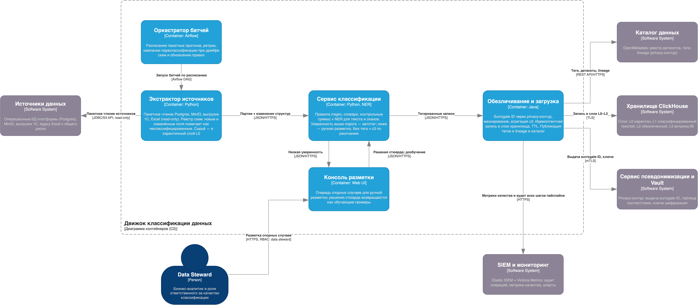

# Задание 6. Движок классификации данных перед загрузкой в хранилище

## Вывод

Движок классификации — обязательный шлюз на пути данных в аналитическое хранилище: ни одна партия данных не попадает в слои, доступные аналитикам, без тегов конфиденциальности и обезличивания.

Принципы: неклассифицированное = c3 по умолчанию (default-deny), устойчивость к изменению структур через реестр схем, спорные случаи — человеку (data steward), качество измеряется метриками и улучшается по петле обратной связи.

## 1. Диаграмма C2

Файл: **[task6-c2-classification-engine.drawio](task6-c2-classification-engine.drawio)**

### Контейнеры движка

| Контейнер | Технология | Назначение |
|---|---|---|
| Оркестратор батчей | Airflow | Расписание прогонов, ретраи, кампании переклассификации при дрейфе схем и обновлении правил |
| Экстрактор источников | Python/Java workers | Пакетное чтение Postgres, MinIO, выгрузок 1С, Excel (read-only); ведёт реестр схем и помечает новые/изменённые поля как неклассифицированные; сырьё кладёт в карантинный слой L0 |
| Сервис классификации | Rule engine + NER | Правила (regex, словари, контрольные суммы СНИЛС/паспорта/телефона) и NER-модель для текста и сканов; уверенность выше порога — автотег, ниже — ручная разметка; поле без тега = c3 |
| Консоль разметки | Web UI | Очередь спорных случаев для data steward; решения возвращаются как обучающие примеры |
| Обезличивание и загрузка | Service | Surrogate ID через privacy-контур, маскирование, агрегация c3; идемпотентная запись в слои, TTL; публикация тегов и lineage в каталог; экспорт метрик и аудита |

### Поток обработки

1. Оркестратор по расписанию запускает батч → экстрактор читает источники (read-only), сверяет структуру с реестром схем (новые и изменённые поля получают статус «неклассифицировано»), складывает сырьё в карантин L0.
2. Сервис классификации размечает партии: структурированные поля — правилами, текст и сканы — NER (Named Entity Recognition — модель распознавания именованных сущностей: Ф. И. О., адресов, диагнозов в свободном тексте). Уверенность выше порога — автотег; ниже — очередь ручной разметки; решения стюарда возвращаются как обучающие примеры.
3. Тегированные записи проходят обезличивание (c2/c3 → surrogate ID, маскирование, агрегаты) и грузятся в слои хранилища; теги и lineage публикуются в каталог; метрики и события аудита уходят в SIEM/мониторинг.

## 2. Устойчивость к изменению структур на входе

Задание фиксирует две особенности входа: структуры меняются и не размечены. Меры:

- **Default-deny.** Любое поле без тега трактуется как c3: оно не попадает дальше карантина, пока не классифицировано. Ошибка «не успели разметить» приводит к задержке данных, а не к утечке.
- **Реестр схем в экстракторе.** Каждая партия сверяется со схемой прошлого прогона; добавленное поле, смена типа, переименование — сигнал на классификацию только дельты, а не всего датасета.
- **Классификация по содержимому, а не по имени поля.** Правила и NER работают со значениями: поле `col_17` со СНИЛС будет поймано контрольной суммой, даже если имя ни о чём не говорит.
- **Версионирование правил и модели.** Каждый тег хранит версию правила, которой присвоен; при обновлении правил оркестратор переклассифицирует только датасеты со старыми версиями.

## 3. Организация слоёв хранилища

Хранилище частично содержит конфиденциальные данные — это учтено разделением на слои с разными режимами доступа:

| Слой | Содержимое | Доступ | Меры |
|---|---|---|---|
| **L0 — карантин** | Сырые партии как в источнике, включая неклассифицированные | Только движок классификации | Шифрование, TTL 7–14 дней (после классификации сырьё удаляется), режим c3 по умолчанию |
| **L1 — классифицированный технический** | Данные с тегами, ещё идентифицируемые (нужны для сверок и повторной обработки) | Движок; офицер безопасности по заявке | Шифрование, колоночные теги, аудит каждого запроса, TTL по retention-политике |
| **L2 — обезличенный** | Псевдонимизированные данные: surrogate ID вместо ПДн, c3 — агрегаты | Аналитики (RBAC: analyst), BI/ML | Основной рабочий слой; обратное разрешение изнутри невозможно |
| **L3 — витрины** | Агрегаты для дашбордов | BI-инструменты, руководство | Только производные показатели без квази-идентификаторов |

## 4. Метрики эффективности классификации

| Метрика | Целевое значение | Как используется для оптимизации |
|---|---|---|
| Recall по классу c3 (доля найденных конфиденциальных полей) | ≥ 99 %; пропуск c3 — критичный инцидент | Пропуски (найденные аудитом или стюардом) → новые правила, дообучение NER; главная метрика системы |
| Precision по классам | ≥ 95 % | Ложные срабатывания перегружают ручную разметку и карантин → уточнение правил |
| Доля автоматической классификации | рост с ~70 % до 95 %+ | Низкая доля = высокая нагрузка на стюарда → приоритет дообучения на его решениях |
| Длительность батча | Прогон укладывается в ночное окно | Деградация → параллелизм воркеров (см. п. 5), профилирование узкого шага |

Петля оптимизации: решения стюарда и найденные пропуски образуют эталонную выборку → на ней еженедельно пересчитываются precision/recall → изменения правил и модели проходят регрессионный прогон на выборке до выката.

## 5. Масштабируемость

1. **Stateless-шаги пайплайна.** Экстрактор, классификатор и загрузчик не хранят состояние; Airflow на Kubernetes параллелит задачи по партициям (датасет, диапазон дат) — рост объёма ×5 закрывается числом параллельных задач, без изменения архитектуры.
2. **Инкрементальность.** Классифицируются только новые данные и дельты схем; полная переклассификация — управляемая кампания по ночным окнам.
3. **Идемпотентность.** Повтор партии не создаёт дублей (ключ партии + upsert) — прогоны можно безопасно перезапускать.
4. **Хранилище.** ClickHouse масштабируется шардированием по датам/филиалам и репликами для чтения; L0/L1 держат короткий TTL, рост объёма концентрируется в сжатом L2.
5. **Новые филиалы и источники** подключаются конфигурацией экстрактора — правила, каталог и политики центральные, перевалидация не требуется (Privacy by Design из Task 2).
6. **Рост числа пользователей аналитики** движок не затрагивает (он пишет, а не обслуживает запросы) — нагрузку чтения принимают реплики ClickHouse и витрины L3.

## Trade-offs (что сознательно упрощено)

- **Нет выделенной очереди (Kafka).** Для пакетного режима буфером служат карантинный слой L0 и планировщик Airflow. Если появится потребность в near-real-time загрузке или объёмы перестанут укладываться в окна — очередь добавляется между экстрактором и классификатором без перестройки остального.
- **Публикация тегов, метрик и загрузка объединены.** Меньше сетевых взаимодействий и точек отказа; цена — менее гранулярное масштабирование финального шага.
- **Батчевая обработка** (по заданию): данные в аналитике отстают на цикл прогона; переход на микробатчи возможен в рамках той же схемы.
